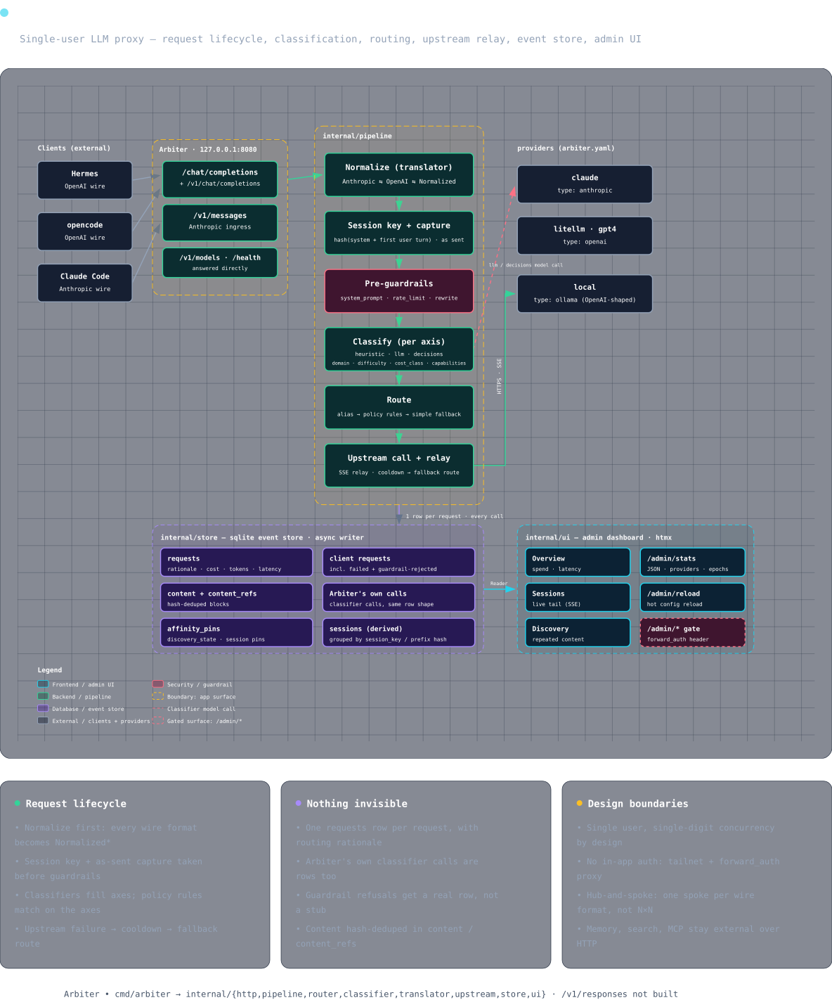

# Arbiter

## docs

- [Getting Started](./getting-started.md)
- [Configuration](./configuration.md)
- [Routing](./routing.md)
- [Observability](./observability.md)
- [Guardrails](./guardrails.md)
- [Client Info](./clients.md)
